# Setup Guide: CachyOS & Hermes Agent (with Ollama or OpenAI)

Welcome to the ultimate setup guide for running **Hermes Agent** on **CachyOS**. CachyOS is a highly optimized Arch Linux-based distribution designed for maximum system performance and responsiveness, making it the perfect local environment to run autonomous agents and local LLMs. 

This guide will walk you through setting up CachyOS, installing Ollama (with GPU acceleration), installing Hermes Agent, and configuring it with either a local Ollama model or cloud-based OpenAI APIs.

### Architecture Overview

```mermaid
graph TD
    User([User CLI / TUI]) <-->|Interacts with| Hermes[Hermes Agent]
    
    subgraph local ["Local Environment (CachyOS)"]
        Hermes <-->|Local API Port 11434| Ollama[Ollama Service]
        Ollama <-->|Hardware Acceleration| GPU[("GPU: CUDA / ROCm / Vulkan")]
        Hermes <-->|Executes commands| Shell[System Shell & OS Tools]
    end

    subgraph cloud ["Cloud Environment"]
        Hermes <-->|Secure HTTPS API| OpenAI[OpenAI API / GPT-4o]
    end

    style local fill:#152822,stroke:#00a36c,stroke-width:2px;
    style cloud fill:#1a1530,stroke:#6e34eb,stroke-width:1px;
    style GPU fill:#232420,stroke:#ffcc00,stroke-width:1px;
```



---

## Table of Contents
1. [Quick Start (Automated Script)](#quick-start-automated-script)
2. [Prerequisites & System Requirements](#2-prerequisites--system-requirements)
3. [Step 1: Installing & Optimizing CachyOS](#step-1-installing--optimizing-cachyos)
4. [Step 2: Installing Ollama (Local Inference)](#step-2-installing-ollama-local-inference)
5. [Step 3: Installing Hermes Agent](#step-3-installing-hermes-agent)
6. [Step 4: Configuring LLM Providers](#step-4-configuring-llm-providers)
   - [Option A: Local Inference via Ollama](#option-a-local-inference-via-ollama)
   - [Option B: Cloud Inference via OpenAI](#option-b-cloud-inference-via-openai)
7. [Step 5: Running & Interacting with Hermes](#step-5-running--interacting-with-hermes)
8. [Troubleshooting & Common Errors](#troubleshooting--common-errors)
9. [Customizing Hermes with Skills](#9-customizing-hermes-with-skills)

---

## Quick Start (Automated Script)

For a streamlined installation on an existing CachyOS setup, you can use our automated setup script which detects your GPU type and configures Ollama, system drivers, user groups, and the Hermes Agent automatically:

```bash
# Clone the repository
git clone https://github.com/NishantJLU/Cachy-OS-guide.git
cd Cachy-OS-guide

# Execute the setup script
./setup.sh
```

---

## 2. Prerequisites & System Requirements

Before you begin, ensure your hardware meets the recommended requirements:

| Component | Minimum | Recommended (Local LLMs) |
| :--- | :--- | :--- |
| **CPU** | x86-64-v3 capable processor | Recent Intel Core or AMD Ryzen with AVX2/AVX512 |
| **RAM** | 8 GB | 16 GB or 32 GB (For 8B+ models) |
| **Storage** | 50 GB (SSD) | 100+ GB NVMe SSD |
| **GPU** | Integrated Graphics | Dedicated NVIDIA (GTX 900+ / RTX) or AMD (GCN 1.0+ / Radeon) |
| **Network** | Stable Internet Connection | 50 Mbps+ (For downloading OS packages & LLMs) |

> [!WARNING]
> Running local LLMs and autonomous agents on virtual machines (VMs) is **not recommended** due to virtualized GPU limitations and significant performance overhead. For the best experience, install CachyOS bare-metal.

---

## Step 1: Installing & Optimizing CachyOS

CachyOS utilizes optimized kernels, compilers, and repositories (compiled with `-O3` and `march=x86-64-v3/v4`) to deliver exceptional desktop performance.

### 1.1 Download and Write ISO
1. Navigate to the official [CachyOS Downloads](https://cachyos.org/download) page.
2. Download the latest desktop ISO (KDE Plasma is recommended for the best system integration and Wayland support).
3. Flash the ISO to a USB drive (at least 8GB):
   - **On Linux (CLI):** `sudo dd if=cachyos-kde-*.iso of=/dev/sdX bs=4M status=progress oflag=sync` (Replace `sdX` with your USB drive).
   - **On Windows/Linux (GUI):** Use [Ventoy](https://www.ventoy.net/) (highly recommended for multi-boot) or [Rufus](https://rufus.ie/).

### 1.2 System Installation
1. Boot into your BIOS/UEFI settings and select the bootable USB.
2. Select the option to boot with **NVIDIA Drivers** (if using an NVIDIA GPU) or **Default Drivers** (for AMD/Intel).
3. Once in the live environment, open the CachyOS Hello app and click **Launch Installer**.
4. Follow the Calamares installer steps:
   - **Partitioning:** Select **Erase Disk** (with BTRFS filesystem for quick snapshots) or partition manually.
   - **Kernel Selection:** The default `linux-cachyos` is highly optimized. You can also opt for `linux-cachyos-bore` for improved scheduling under heavy loads.
   - **Packages:** Select any extra packages you want (like Git, base-devel).
5. Complete the installation and reboot your system.

### 1.3 Post-Install Optimizations
Open your terminal and ensure your system repositories and packages are up-to-date:
```bash
sudo pacman -Syu
```
Install system build tools and utilities:
```bash
sudo pacman -S --needed base-devel git curl xz ripgrep ffmpeg
```

---

## Step 2: Installing Ollama (Local Inference)

For running Hermes Agent locally without relying on paid APIs, **Ollama** is the ideal backend. On CachyOS, Ollama is available in the official extra repositories.

### 2.1 Install Ollama with GPU Acceleration
Choose the installation command corresponding to your GPU hardware to ensure hardware acceleration is active:

*   **NVIDIA GPUs (CUDA):**
    ```bash
    sudo pacman -S ollama ollama-cuda
    ```
*   **AMD GPUs (ROCm):**
    ```bash
    sudo pacman -S ollama ollama-rocm
    ```
*   **Other/Intel GPUs (Vulkan):**
    ```bash
    sudo pacman -S ollama ollama-vulkan
    ```
*   **CPU-only Installation:**
    ```bash
    sudo pacman -S ollama
    ```

### 2.2 Enable and Start the Systemd Service
To start Ollama immediately and ensure it launches automatically at boot, run:
```bash
sudo systemctl enable --now ollama.service
```

Verify that the service is running successfully:
```bash
systemctl status ollama.service
```

### 2.3 Pull Recommended LLM Models
To run Hermes Agent, you need a highly capable instruction-following LLM. Nous Research recommends their own fine-tuned models:
```bash
# Pull the highly capable Hermes 3 Llama-3 8B model
ollama run hermes3:8b

# Alternatively, pull standard Llama 3 / 3.1 models
ollama pull llama3.1
```
Verify the model list using:
```bash
ollama list
```

---

## Step 3: Installing Hermes Agent

**Hermes Agent** is an autonomous AI assistant developed by Nous Research. It features a persistent memory system and automatically creates its own reusable skills to handle complex system tasks.

### 3.1 Automated CLI Installation
Run the official one-liner script to install Hermes:
```bash
curl -fsSL https://hermes-agent.nousresearch.com/install.sh | bash
```

> [!NOTE]
> The install script automatically installs the necessary backend dependencies if not already present, including the fast Python package manager `uv`, Python 3.11+, and Node.js 18+ (used for browser tools and CLI/TUI).

### 3.2 Reload Shell Configuration
Apply the changes made by the installer script to your active terminal path:
```bash
source ~/.bashrc
# Or if you use Zsh
source ~/.zshrc
```

Verify the installation was successful by showing the version and configuration file location:
```bash
hermes --version
```

---

## Step 4: Configuring LLM Providers

Hermes Agent stores its configs under `~/.hermes/` (specifically `config.yaml` for options and `.env` for secrets). You can configure it dynamically using the CLI commands.

### Option A: Local Inference via Ollama
Ensure your Ollama service is active and running locally on port `11434`.

1. Run the interactive model selector command:
   ```bash
   hermes model
   ```
2. Select **Custom / OpenAI-Compatible Endpoint**.
3. Set the API Base URL to the Ollama endpoint:
   ```text
   http://localhost:11434/v1
   ```
4. Set the Model name to the exact name shown in `ollama list` (e.g., `hermes3:8b` or `llama3.1`).
5. Since Ollama runs locally on your hardware, processing times can be longer (especially on CPUs). Increase the default API timeout:
   ```bash
   hermes config set HERMES_API_TIMEOUT 1800
   ```

### Option B: Cloud Inference via OpenAI
If you prefer to use cloud models (like `gpt-4o` or `gpt-4-turbo`), you can connect directly to OpenAI.

1. Generate your OpenAI API key from the developer portal.
2. Store the API key in the Hermes configuration:
   ```bash
   hermes config set OPENAI_API_KEY "sk-proj-YourOpenAiApiKeyHere..."
   ```
3. Run the model configuration command to select OpenAI:
   ```bash
   hermes model
   ```
4. Choose **OpenAI** as the provider and select your preferred model (e.g., `gpt-4o`).

---

## Step 5: Running & Interacting with Hermes

Now that the agent is installed and configured, you are ready to use it!

### 5.1 Interactive CLI Chat
Launch the interactive Terminal User Interface (TUI) to converse and prompt the agent:
```bash
hermes chat
```

### 5.2 Single-Command Execution
You can ask Hermes to run a specific task or build a script directly from your terminal:
```bash
hermes run "create a system monitor script in bash and save it to ~/scripts/monitor.sh"
```

### 5.3 Web Portal (GUI Setup)
If you prefer a browser interface rather than the CLI:
1. Run the portal configuration script:
   ```bash
   hermes setup --portal
   ```
2. Open the URL printed in the terminal (usually `http://localhost:3000` or a remote console link) to manage your agent, visual state, and configurations.

### 5.4 Using Profiles
You can keep your configurations separated (e.g., one for Local Ollama, one for OpenAI):
```bash
# Create a profile for local work
hermes profile create local-ollama
hermes profile use local-ollama

# Create a profile for cloud APIs
hermes profile create openai-cloud
hermes profile use openai-cloud
```

---

## Troubleshooting & Common Errors

Here are the most common errors users face during setup and how to resolve them.

### 1. Connection Refused / "Failed to connect to Ollama"
*   **Symptoms:** Hermes displays connection errors or timeouts when trying to reach `http://localhost:11434/v1`.
*   **Causes:** The Ollama systemd service is either not running or not listening on the correct interface.
*   **Solutions:**
    1.  Verify the service is active:
        ```bash
        sudo systemctl status ollama.service
        ```
        If it's inactive, run:
        ```bash
        sudo systemctl enable --now ollama.service
        ```
    2.  If running Hermes inside an isolated environment (like Docker, a container, or a VM) and Ollama is on the host, localhost will not resolve. Allow Ollama to listen on all interfaces by creating a systemd override:
        ```bash
        sudo systemctl edit ollama.service
        ```
        Add the environment variable inside the file:
        ```ini
        [Service]
        Environment="OLLAMA_HOST=0.0.0.0"
        ```
        Save the file, then reload and restart:
        ```bash
        sudo systemctl daemon-reload
        sudo systemctl restart ollama.service
        ```
    3.  Test your connection outside Hermes:
        ```bash
        curl http://localhost:11434/api/tags
        ```

### 2. GPU Not Detected / Extremely Slow Inference (CPU Fallback)
*   **Symptoms:** System CPU spikes to 100%, and RAM usage is high, while GPU usage remains at 0%. Text generation is extremely slow.
*   **Causes:** Missing hardware-specific libraries (CUDA/ROCm) or incorrect user permissions for GPU render nodes.
*   **Solutions:**
    1.  Ensure you have installed the correct GPU driver integration package on CachyOS:
        -   **NVIDIA:** `sudo pacman -S ollama-cuda`
        -   **AMD:** `sudo pacman -S ollama-rocm`
        -   **Intel/Other:** `sudo pacman -S ollama-vulkan`
    2.  Ensure your user is in the `video` and `render` groups to access GPU rendering nodes:
        ```bash
        sudo usermod -aG video,render $USER
        ```
        *(Log out and log back in for changes to apply).*
    3.  **For AMD GPUs:** If ROCm does not support your specific GPU architecture natively, you may need to force override the version. Add this line to `~/.bashrc` (or `/etc/environment`):
        ```bash
        export HSA_OVERRIDE_GFX_VERSION=10.3.0  # For Radeon RX 6000 series, adjust version as needed
        ```
        Then restart the service: `sudo systemctl restart ollama.service`.

### 3. command not found: hermes
*   **Symptoms:** Terminal returns `bash: hermes: command not found` after running the installer script.
*   **Causes:** The directory containing the newly installed binary is not part of your active shell's `$PATH` variable.
*   **Solutions:**
    1.  The install script places the binary in `~/.local/bin` or your user binary directory. Refresh your terminal session:
        ```bash
        source ~/.bashrc
        # Or if you use Zsh
        source ~/.zshrc
        ```
    2.  If it still cannot be found, check if `~/.local/bin` is in your path:
        ```bash
        echo $PATH
        ```
    3.  If missing, append it manually by adding this line to the end of your shell config file (`~/.bashrc` or `~/.zshrc`):
        ```bash
        export PATH="$HOME/.local/bin:$PATH"
        ```

### 4. API Read Timeouts (Agent freezes or errors out)
*   **Symptoms:** Under heavy local loads or when running larger models (e.g. 8B+ or 13B+), Hermes raises `ReadTimeout` exceptions.
*   **Causes:** The default timeout configuration is too low for the hardware to process the model's response.
*   **Solutions:**
    1.  Configure a higher timeout limit using the CLI (value is in seconds):
        ```bash
        hermes config set HERMES_API_TIMEOUT 1800
        ```
    2.  Verify the updated configuration:
        ```bash
        hermes config
        ```

### 5. OpenAI 401 Unauthorized Errors
*   **Symptoms:** Errors stating API authentication failed or returned status code 401.
*   **Causes:** Missing, invalid, or expired OpenAI API key.
*   **Solutions:**
    1.  Ensure the key begins with `sk-` and contains no trailing whitespace.
    2.  Set it correctly in your Hermes configuration:
        ```bash
        hermes config set OPENAI_API_KEY "sk-proj-..."
        ```
    3.  Alternatively, inspect the secrets env file directly to ensure it was written properly:
        ```bash
        cat ~/.hermes/.env
        ```

### 6. Tool Execution & Sandbox Permission Errors
*   **Symptoms:** Hermes cannot create directories, run scripts, or compile native packages, printing permissions errors.
*   **Causes:** Security settings in the workspace are restricting execution, or standard compiler tools are missing.
*   **Solutions:**
    1.  Ensure compilation utilities are present on CachyOS:
        ```bash
        sudo pacman -S --needed base-devel
        ```
    2.  Configure tool sandbox settings inside your configuration file:
        ```bash
        hermes config edit
        ```
        In the editor, modify target tools or check `~/.hermes/logs/` for detailed error trace outputs to see which tool execution triggered the sandbox warning.

---

## 9. Customizing Hermes with Skills

This repository includes custom pre-configured skills that teach your Hermes Agent how to perform CachyOS system-specific tasks:
*   [cachyos_system_info](file:///home/nishoo/Projects/Cachy%20OS%20Guide/skills/cachyos_system_info/SKILL.md) — Inspects CPU governor, active optimization flags, BTRFS configurations, and kernel type.
*   [system_monitoring](file:///home/nishoo/Projects/Cachy%20OS%20Guide/skills/system_monitoring/SKILL.md) — Checks memory footprint, top CPU-consuming tasks, and GPU usage metrics.

### How to use these skills:
To register these skills with your local Hermes Agent:
1. Copy the skills to your local custom skills directory (usually under `~/.hermes/skills/` or the `.agents/skills/` directory inside your active project root):
   ```bash
   mkdir -p ~/.hermes/skills/
   cp -r skills/* ~/.hermes/skills/
   ```
2. Restart your Hermes Agent CLI session.
3. Test a skill trigger in chat:
   > *"Check CachyOS system performance profile"*
