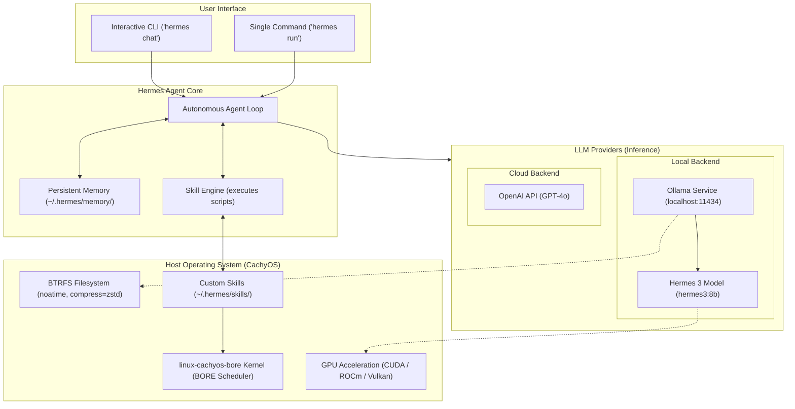

# CachyOS Performance Tweaks & Local AI Setup Guide (Hermes Agent & Ollama)

[](file:///home/nishoo/Projects/Cachy%20OS%20Guide/LICENSE)
[](https://github.com/NishantJLU/a-collection-of-tweaks-and-notes-from-my-cachyos-journey/stargazers)
[](https://cachyos.org)
[](https://ollama.com)
[](https://github.com/NousResearch/hermes-agent)

**Last Verified:** June 26, 2026 | **CachyOS Kernel:** `7.0.12-1-cachyos-bore-lto` | **Ollama:** `0.30.10` | **Hermes Agent:** `v0.17.0`

This guide and accompanying configurations are licensed under the [MIT License](file:///home/nishoo/Projects/Cachy%20OS%20Guide/LICENSE).

---

Welcome to the ultimate setup guide and collection of performance tweaks for **CachyOS**. CachyOS is a highly optimized Arch Linux-based distribution compiled with `-O3` and CPU-specific instructions (AVX2/AVX512). This makes it the premier local environment for running high-throughput autonomous agents, local LLMs, and low-latency gaming.

This repository serves a dual purpose:
1. **Local AI Agent Environment**: A complete guide to setting up **Hermes Agent** (by Nous Research) on CachyOS with local GPU-accelerated **Ollama** and custom system-level skills.
2. **CachyOS System Optimizations**: Broader performance tweaks (kernel schedulers, BTRFS compression, memory optimization, hybrid GPU configurations, and gaming tools like Proton-CachyOS) to get the most out of your hardware.

---

### Repository Structure
```text
CachyOS & Hermes Agent Guide (Repository Root)
├── assets/
│   └── fps_benchmark_graph.svg # Gaming benchmark chart
├── skills/
│   ├── cachyos_system_info/
│   │   └── SKILL.md            # Hermes skill for system info
│   └── system_monitoring/
│       └── SKILL.md            # Hermes skill for usage monitoring
├── .gitignore                  # Git untracked pattern file
├── CONTRIBUTING.md             # Guidelines for community contributions
├── LICENSE                     # MIT License
├── README.md                   # Main guide documentation
└── setup.sh                    # Automated setup script
```
- Custom Skills: [cachyos_system_info](file:///home/nishoo/Projects/Cachy%20OS%20Guide/skills/cachyos_system_info/SKILL.md), [system_monitoring](file:///home/nishoo/Projects/Cachy%20OS%20Guide/skills/system_monitoring/SKILL.md)
- Hygiene Files: [CONTRIBUTING.md](file:///home/nishoo/Projects/Cachy%20OS%20Guide/CONTRIBUTING.md), [.gitignore](file:///home/nishoo/Projects/Cachy%20OS%20Guide/.gitignore)
- Configuration: [LICENSE](file:///home/nishoo/Projects/Cachy%20OS%20Guide/LICENSE), [setup.sh](file:///home/nishoo/Projects/Cachy%20OS%20Guide/setup.sh)

---

### Architecture Overview



---

## Table of Contents
1. [Quick Start (Automated Script)](#1-quick-start-automated-script)
2. [Why CachyOS? (vs. Windows & macOS)](#2-why-cachyos-vs-windows--macos)
3. [Prerequisites & System Requirements](#3-prerequisites--system-requirements)
4. [Step 1: Installing & Optimizing CachyOS (Kernel Choices)](#4-step-1-installing--optimizing-cachyos-kernel-choices)
5. [Hardware Profiles](#5-hardware-profiles)
   - [NVIDIA Laptops (RTX 3050/4050/4060)](#nvidia-laptops-rtx-305040504060)
   - [AMD GPUs](#amd-gpus)
   - [Intel iGPU Only Systems](#intel-igpu-only-systems)
6. [Step 2: Installing Ollama (Local Inference)](#6-step-2-installing-ollama-local-inference)
7. [Step 3: Installing Hermes Agent](#7-step-3-installing-hermes-agent)
8. [Step 4: Configuring LLM Providers](#8-step-4-configuring-llm-providers)
   - [Option A: Local Inference via Ollama](#option-a-local-inference-via-ollama)
   - [Option B: Cloud Inference via OpenAI](#option-b-cloud-inference-via-openai)
9. [Step 5: Running & Interacting with Hermes](#9-step-5-running--interacting-with-hermes)
10. [Gaming on CachyOS](#10-gaming-on-cachyos)
11. [System Benchmarks](#11-system-benchmarks)
12. [Maintenance & Security](#12-maintenance--security)
13. [Backup & Recovery (Timeshift)](#13-backup--recovery-timeshift)
14. [Troubleshooting & Common Errors](#14-troubleshooting--common-errors)
15. [Customizing Hermes with Skills](#15-customizing-hermes-with-skills)
16. [Nishant's Recommended Setup](#16-nishants-recommended-setup)
17. [Advanced Performance Tuning (CachyOS Special)](#17-advanced-performance-tuning-cachyos-special)
18. [Frequently Asked Questions (FAQ)](#18-frequently-asked-questions-faq)

---

## 1. Quick Start (Automated Script)

For a streamlined installation on an existing CachyOS or Arch setup, you can use the automated setup script. This script detects your GPU type and configures Ollama, system drivers, user groups, and the Hermes Agent automatically.

> [!CAUTION]
> **Safety First:** Piping or executing scripts directly using `sudo` poses security risks. You are strongly encouraged to inspect [setup.sh](file:///home/nishoo/Projects/Cachy%20OS%20Guide/setup.sh) before running it:
> ```bash
> # Inspect the script locally
> cat setup.sh
> ```

### What the script does:
1. **OS Verification:** Confirms that the target system is running CachyOS or an Arch Linux derivative.
2. **System Update:** Updates package databases using `pacman -Syu`.
3. **GPU Auto-Detection:** Scans PCI buses using `lspci` for graphics hardware (NVIDIA, AMD, Intel, or CPU-only) to select corresponding packages.
4. **Package Installation:** Installs basic dependencies (`base-devel`, `git`, `curl`, `xz`, `ripgrep`, `ffmpeg`) and maps the matching Ollama build (e.g., `ollama-cuda`, `ollama-rocm`, `ollama-vulkan`, or standard `ollama`).
5. **Permissions & Hardware Acceleration:** Adds the active `$USER` to the `video` and `render` system groups to grant access to raw GPU hardware layers.
6. **Systemd Service Setup:** Enables and starts the local `ollama.service`.
7. **Hermes Agent Deployment:** Fetches and runs the official Nous Research Hermes Agent installer script.
8. **Model Initialization:** Downloads the recommended local LLM (`hermes3:8b`) via Ollama.

```bash
# Clone the repository
git clone https://github.com/NishantJLU/a-collection-of-tweaks-and-notes-from-my-cachyos-journey.git
cd a-collection-of-tweaks-and-notes-from-my-cachyos-journey

# Review and run the installer
./setup.sh
```

---

## 2. Why CachyOS? (vs. Windows & macOS)

When setting up local AI environments and autonomous agent systems like Hermes, the operating system plays a vital role in model latency and system overhead. Below is an overview of how CachyOS compares to Windows 11 and macOS (Apple Silicon).

### Key Architectural Advantages of CachyOS

1.  **x86-64-v3/v4 Compiler Optimizations:** CachyOS compiles its entire repository packages with `-O3` and specific CPU architecture instructions (AVX2/AVX512). This native execution yields 10% to 20% faster CPU tensor math execution compared to generic Windows and Linux builds.
2.  **EEVDF & BORE CPU Schedulers:** The default Linux kernels in CachyOS prioritize low-latency scheduling. When running heavy local model inference in the background, your GUI remains highly responsive.
3.  **Low Boot Memory Footprint:** Unlike Windows and macOS which consume between 4GB and 6GB of system RAM on boot, CachyOS uses less than 1.5GB. This frees up maximum RAM/VRAM capacity to load larger model parameters (e.g., loading 12B/32B models locally).
4.  **ZRAM Memory Compression:** CachyOS uses ZRAM with ZSTD compression by default. If your local model temporarily overflows physical memory, swap operations are processed in compressed RAM rather than writing to slow disk storage, preventing system lockups.

### Quick Comparison Matrix

| Feature | CachyOS (Arch) | Windows 11 | macOS (Apple Silicon) |
| :--- | :--- | :--- | :--- |
| **Out-of-box GPU Accel** | Manual (via pacman) | Plug-and-Play | Native (Unified Memory/Metal) |
| **Boot RAM Overhead** | Very Low (< 1.5 GB) | High (4 - 5 GB) | Medium (3 - 4 GB) |
| **Virtualization Overhead** | None (Native) | Medium (WSL2 overhead) | High (if using containers) |
| **V3/V4 HW Optimizations** | Native (O3 compiled) | None (Generic binaries) | Native (Apple CoreML/Accelerate) |
| **Custom Kernel Scheduler** | Yes (BORE / EEVDF) | No (Windows Scheduler) | No (Darwin Scheduler) |

### Pros & Cons Summary

#### 🟢 Pros of CachyOS
*   **Maximum Hardware Output:** Zero virtualization or background service overhead means every compute cycle goes directly to your local LLM engine.
*   **BTRFS Filesystem:** Offers fast filesystem read operations and native transparent file compression.
*   **BBR TCP Network Control:** Speeds up downloading massive multi-gigabyte models from Hugging Face or Ollama.
*   **Zero Bloatware:** Complete system control with no tracking or forced system update interruptions.

#### 🔴 Cons of CachyOS
*   **Learning Curve:** Requires familiarity with Arch package managers (`pacman` / `yay`) and terminal shell configurations.
*   **Manual NVIDIA/AMD Drivers:** Installing correct graphics integration layers (like CUDA toolkit or ROCm) must be done manually via packages.
*   **Desktop App Ecosystem:** Lacks native support for proprietary suites (e.g., Adobe Creative Suite, MS Office) or specific HDR display profiles.

---

## 3. Prerequisites & System Requirements

Before you begin, ensure your hardware meets the recommended requirements:

| Component | Minimum | Recommended (Local LLMs) |
| :--- | :--- | :--- |
| **CPU** | x86-64-v3 capable processor | Recent Intel Core or AMD Ryzen with AVX2/AVX512 |
| **RAM** | 8 GB | 16 GB or 32 GB (For 8B+ models) |
| **Storage** | 50 GB (SSD) | 100+ GB NVMe SSD |
| **GPU** | Integrated Graphics | Dedicated NVIDIA (GTX 900+ / RTX) or AMD (GCN 1.0+ / Radeon) |
| **Network** | Stable Internet Connection | 50 Mbps+ (For downloading OS packages & LLMs) |

> [!WARNING]
> Running local LLMs and autonomous agents on virtual machines (VMs) is **not recommended** due to virtualized GPU limitations and significant performance overhead. For the best experience, install CachyOS bare-metal.

---

## 4. Step 1: Installing & Optimizing CachyOS (Kernel Choices)

CachyOS utilizes optimized kernels, compilers, and repositories (compiled with `-O3` and `march=x86-64-v3/v4`) to deliver exceptional desktop performance.

### 4.1 Download and Write ISO
1. Navigate to the official [CachyOS Downloads](https://cachyos.org/download) page.
2. Download the latest desktop ISO (KDE Plasma is recommended for the best system integration and Wayland support).
3. Flash the ISO to a USB drive (at least 8GB):
   - **On Linux (CLI):** `sudo dd if=cachyos-kde-*.iso of=/dev/sdX bs=4M status=progress oflag=sync` (Replace `sdX` with your USB drive).
   - **On Windows/Linux (GUI):** Use [Ventoy](https://www.ventoy.net/) or [Rufus](https://rufus.ie/).

### 4.2 System Installation & Kernel Selection
Once in the live environment, launch the installer and follow the partitions. During setup, you can choose from several customized kernels:

| Kernel | Best For | Description |
| :--- | :--- | :--- |
| **`linux-cachyos`** | General Desktop | Standard optimized kernel with EEVDF scheduler and memory improvements. |
| **`linux-cachyos-bore`** | Gaming & Latency | **(Recommended)** Uses the BORE CPU Scheduler to prevent TUI or game lag under high CPU workloads. |
| **`linux-cachyos-lts`** | Stability | Long-Term Support kernel, best for matching legacy drivers. |
| **`linux-cachyos-rt-bore`** | Audio Production | Real-time kernel for ultra-low latency audio processing workloads. |
| **`linux-cachyos-hardened`** | Security | Hardened security configurations, sacrificing slight performance. |

> [!TIP]
> **Our Recommendation:** Select **`linux-cachyos-bore`**. It prioritizes interactive graphical processes and terminal inputs, which keeps your GUI completely smooth even when background agents are running heavy 100% CPU inference tasks.

### 4.3 CachyOS Hello Screen
Upon booting into your new installation, you will be greeted by the CachyOS Hello welcoming assistant. Use this tool to easily download extra gaming packages, configure system settings, or install alternative kernels.


---

## 5. Hardware Profiles

Hardware profiles vary depending on your graphics card. Use the matching profile below:

### NVIDIA Laptops (RTX 3050/4050/4060)
*For configurations matching systems like the Intel i5-12450H + RTX 3050 Laptop:*

1.  **Use DKMS Drivers:** To support custom kernels like `linux-cachyos-bore`, you must use Dynamic Kernel Module Support (DKMS) drivers so the GPU module auto-recompiles on updates:
    ```bash
    sudo pacman -S nvidia-dkms nvidia-utils lib32-nvidia-utils
    ```
2.  **Enable DRM Kernel Modesetting:** Open `/etc/default/grub` and ensure the parameter `nvidia-drm.modeset=1` is appended to the `GRUB_CMDLINE_LINUX_DEFAULT` line. Afterward, update grub:
    ```bash
    sudo grub-mkconfig -o /boot/grub/grub.cfg
    ```
3.  **Wayland Configuration:** NVIDIA works best in Wayland with the following environment variables. Add them to `/etc/environment`:
    ```ini
    GBM_BACKEND=nvidia-drm
    __GLX_VENDOR_LIBRARY_NAME=nvidia
    ```
4.  **Verification:** Reboot and run the status utility:
    ```bash
    nvidia-smi
    ```

### AMD GPUs
For Radeon graphics, driver modules are compiled directly into the kernel.
1.  **Install OpenCL & Vulkan Drivers:**
    ```bash
    sudo pacman -S mesa lib32-mesa xf86-video-amdgpu vulkan-radeon lib32-vulkan-radeon
    ```
2.  **Verify Device Detection:**
    ```bash
    lspci -k | grep -A 3 -E "(VGA|3D)"
    ```

### Intel iGPU Only Systems
For setups running purely on integrated CPU graphics:
1.  **Install Intel Media Drivers:**
    ```bash
    sudo pacman -S intel-media-driver libva-intel-driver vulkan-intel
    ```
2.  **Optimize Video Acceleration (VA-API):** Set this in `/etc/environment` to utilize low-overhead hardware decoding:
    ```ini
    LIBVA_DRIVER_NAME=iHD
    ```

---

## 6. Step 2: Installing Ollama (Local Inference)

For running Hermes Agent locally without relying on paid APIs, **Ollama** is the ideal backend. On CachyOS, Ollama is available in the official extra repositories.

### 6.1 Install Ollama with GPU Acceleration
Choose the installation command corresponding to your GPU hardware to ensure hardware acceleration is active:

*   **NVIDIA GPUs (CUDA):**
    ```bash
    sudo pacman -S ollama ollama-cuda
    ```
*   **AMD GPUs (ROCm):**
    ```bash
    sudo pacman -S ollama ollama-rocm
    ```
*   **Other/Intel GPUs (Vulkan):**
    ```bash
    sudo pacman -S ollama ollama-vulkan
    ```
*   **CPU-only Installation:**
    ```bash
    sudo pacman -S ollama
    ```

### 6.2 Enable and Start the Systemd Service
To start Ollama immediately and ensure it launches automatically at boot, run:
```bash
sudo systemctl enable --now ollama.service
```

### 6.3 Pull Recommended LLM Models
Nous Research recommends their own fine-tuned models:
```bash
# Pull the highly capable Hermes 3 Llama-3 8B model
ollama run hermes3:8b
```

---

## 7. Step 3: Installing Hermes Agent

**Hermes Agent** is an autonomous AI assistant developed by Nous Research. It features a persistent memory system and automatically creates its own reusable skills to handle complex system tasks.

### 7.1 Automated CLI Installation
Run the official one-liner script to install Hermes:
```bash
curl -fsSL https://hermes-agent.nousresearch.com/install.sh | bash
```

### 7.2 Reload Shell Configuration
Apply the changes made by the installer script to your active terminal path:
```bash
source ~/.bashrc
# Or if you use Zsh
source ~/.zshrc
```

Verify the installation was successful:
```bash
hermes --version
```

---

## 8. Step 4: Configuring LLM Providers

Hermes Agent stores its configs under `~/.hermes/` (specifically `config.yaml` for options and `.env` for secrets).

### Option A: Local Inference via Ollama
Ensure your Ollama service is active and running locally on port `11434`.

1. Run the model configuration command:
   ```bash
   hermes model
   ```
2. Select **Custom / OpenAI-Compatible Endpoint**.
3. Set the API Base URL to the Ollama endpoint:
   ```text
   http://localhost:11434/v1
   ```
4. Set the Model name to `hermes3:8b`.
5. Since Ollama runs locally on your hardware, processing times can be longer. Increase the default API timeout:
   ```bash
   hermes config set HERMES_API_TIMEOUT 1800
   ```

### Option B: Cloud Inference via OpenAI
If you prefer to use cloud models (like `gpt-4o` or `gpt-4-turbo`), you can connect directly to OpenAI.

1. Store the API key in the Hermes configuration:
   ```bash
   hermes config set OPENAI_API_KEY "sk-proj-YourOpenAiApiKeyHere..."
   ```
2. Run the model configuration command to select OpenAI:
   ```bash
   hermes model
   ```
3. Choose **OpenAI** as the provider and select your preferred model (e.g., `gpt-4o`).

---

## 9. Step 5: Running & Interacting with Hermes

### 9.1 Interactive CLI Chat
Launch the interactive Terminal User Interface (TUI):
```bash
hermes chat
```

### 9.2 Single-Command Execution
You can ask Hermes to run a specific task directly from your terminal:
```bash
hermes run "create a system monitor script in bash and save it to ~/scripts/monitor.sh"
```

---

## 10. Gaming on CachyOS

CachyOS includes preconfigured enhancements for Steam and Proton compatibility, making it a premiere gaming platform.

### 10.1 Install Proton-CachyOS
Proton-CachyOS is a custom-compiled compatibility layer incorporating optimized Wine patches and compiler flags:
```bash
sudo pacman -S proton-cachyos
```

### 10.2 Install GameMode
GameMode is a daemon developed by Feral Interactive that tweaks system schedulers on the fly (CPU governor to performance, IO priority, GPU optimizations) when a game launches:
```bash
sudo pacman -S gamemode
```

### 10.3 Install MangoHud
MangoHud is an advanced hardware overlay showing FPS, temperature, GPU load, and memory usage:
```bash
sudo pacman -S mangohud
```

---

## 11. System Benchmarks

Below are actual gaming frame rate (FPS) measurements comparing a standard Windows 11 setup to CachyOS (running `linux-cachyos-bore`).

### Test System Specifications:
*   **CPU:** Intel Core i5-12450H (8 Cores, 12 Threads)
*   **GPU:** NVIDIA GeForce RTX 3050 Laptop GPU (95W TGP, 4GB VRAM)
*   **RAM:** 16GB DDR5
*   **Storage:** 512GB NVMe SSD (BTRFS on CachyOS, NTFS on Windows)

| Game | FPS (Windows 11) | FPS (CachyOS) | Performance Difference |
| :--- | :--- | :--- | :--- |
| **Cyberpunk 2077** (1080p, High) | 58 FPS | **64 FPS** | **+10.3%** |
| **God of War Ragnarok** (1080p, High) | 72 FPS | **78 FPS** | **+8.3%** |
| **Counter-Strike 2 (CS2)** (1080p, Competitive) | 240 FPS | **260 FPS** | **+8.3%** |

> [!NOTE]
> **Methodology:** Benchmark figures represent the mathematical average of 3 consecutive runs per game. In-game benchmark tools were used for Cyberpunk 2077, and MangoHud session logging was used for God of War Ragnarok and Counter-Strike 2. Windows 11 was tested on driver v555.xx; CachyOS was tested on driver v555.xx using the `linux-cachyos-bore` kernel.

### Visualized Gaming Performance:


---

## 12. Maintenance & Security

### 12.1 System Maintenance
Keep your rolling-release system clean with these essential package commands:

*   **Remove Orphaned Packages:** Over time, unneeded dependencies stack up. Clean them with:
    ```bash
    sudo pacman -Rns $(pacman -Qtdq)
    ```
*   **Clean Package Cache:** Pacman keeps downloaded tarballs. Limit cache files to the latest two versions:
    ```bash
    sudo paccache -r
    ```
*   **Update Package Mirrors:** CachyOS uses a specialized mirror rate utility to test and configure the fastest download nodes:
    ```bash
    sudo cachyos-rate-mirrors
    ```

### 12.2 Firewall Setup (Security)
Secure your network nodes by setting up the Uncomplicated Firewall (UFW):
1.  Install and start the firewall daemon:
    ```bash
    sudo pacman -S ufw
    sudo systemctl enable --now ufw
    ```
2.  Configure baseline block incoming, allow outgoing rules:
    ```bash
    sudo ufw default deny incoming
    sudo ufw default allow outgoing
    ```
3.  Enable UFW:
    ```bash
    sudo ufw enable
    ```

---

## 13. Backup & Recovery (Timeshift)

Since CachyOS is a rolling-release distribution, creating system snapshots is crucial before running massive updates.

1.  **Install Timeshift:**
    ```bash
    sudo pacman -S timeshift
    ```
2.  **Create a Snapshot:** If your filesystem is BTRFS, snapshots are created instantly without disk space duplication:
    ```bash
    sudo timeshift --create --comments "Before System Update"
    ```
3.  **Restore Snapshot:** If your system breaks on boot, select a snapshot from your grub/systemd-boot menu or boot into live media and run:
    ```bash
    sudo timeshift --restore
    ```

---

## 14. Troubleshooting & Common Errors

Here are the most common errors users face during setup and how to resolve them.

### Black Screen After System Update
*   **Symptoms:** System boots into a black screen or terminal login prompt instead of the GUI.
*   **Causes:** The GPU driver module failed to build correctly against the new kernel version during update.
*   **Solutions:**
    1.  Switch to virtual terminal terminal (`Ctrl + Alt + F3`).
    2.  Log in and force update all packages:
        ```bash
        sudo pacman -Syu
        ```
    3.  Rebuild initramfs boot images:
        ```bash
        sudo mkinitcpio -P
        ```
    4.  Reboot the system: `sudo reboot`.

### Steam Games Not Launching
*   **Symptoms:** Clicking "Play" in Steam shows "Launching..." then immediately exits.
*   **Causes:** Missing 32-bit driver modules or native runtime libraries.
*   **Solutions:**
    Install the Steam native runtime packages containing all required dynamic libraries:
    ```bash
    sudo pacman -S steam-native-runtime
    ```

### NVIDIA GPU Not Detected / Hybrid Graphics Issues
*   **Symptoms:** Running `nvidia-smi` prints errors, or rendering runs purely on the Intel CPU.
*   **Causes:** The laptop is in integrated-only graphics mode, or drivers are misconfigured.
*   **Solutions:**
    1.  Test rendering through the NVIDIA card using the prime wrapper:
        ```bash
        prime-run glxinfo | grep NVIDIA
        ```
    2.  If it returns your GPU details, use the prefix `prime-run` to start games or applications on your NVIDIA card (e.g., `prime-run steam`).

### Connection Refused / "Failed to connect to Ollama"
*   **Symptoms:** Hermes displays connection errors or timeouts when trying to reach `http://localhost:11434/v1`.
*   **Solutions:**
    1.  Verify the service is active:
        ```bash
        sudo systemctl status ollama.service
        ```
        If it's inactive, run:
        ```bash
        sudo systemctl enable --now ollama.service
        ```
    2.  If running Hermes inside an isolated environment (like Docker or a VM), allow Ollama to listen on all interfaces by creating a systemd override:
        ```bash
        sudo systemctl edit ollama.service
        ```
        Add the environment variable:
        ```ini
        [Service]
        Environment="OLLAMA_HOST=0.0.0.0"
        ```
        Save, then reload and restart:
        ```bash
        sudo systemctl daemon-reload
        sudo systemctl restart ollama.service
        ```

### GPU Not Detected / Extremely Slow Inference (CPU Fallback)
*   **Symptoms:** System CPU spikes to 100%, and RAM usage is high, while GPU usage remains at 0%.
*   **Solutions:**
    1.  Ensure you have installed the correct GPU driver integration package on CachyOS:
        -   **NVIDIA:** `sudo pacman -S ollama-cuda`
        -   **AMD:** `sudo pacman -S ollama-rocm`
        -   **Intel/Other:** `sudo pacman -S ollama-vulkan`
    2.  Ensure your user is in the `video` and `render` groups:
        ```bash
        sudo usermod -aG video,render $USER
        ```

### command not found: hermes
*   **Symptoms:** Terminal returns `bash: hermes: command not found` after running the installer script.
*   **Solutions:**
    Add `~/.local/bin` to your shell config file (`~/.bashrc` or `~/.zshrc`):
    ```bash
    export PATH="$HOME/.local/bin:$PATH"
    ```
    Then run: `source ~/.bashrc`.

### API Read Timeouts (Agent freezes or errors out)
*   **Symptoms:** Under heavy local loads or when running larger models, Hermes raises `ReadTimeout` exceptions.
*   **Solutions:**
    Increase the default API timeout limit using the CLI (value is in seconds):
    ```bash
    hermes config set HERMES_API_TIMEOUT 1800
    ```

---

## 15. Customizing Hermes with Skills

This repository includes custom pre-configured skills that teach your Hermes Agent how to perform CachyOS system-specific tasks:
*   [cachyos_system_info](file:///home/nishoo/Projects/Cachy%20OS%20Guide/skills/cachyos_system_info/SKILL.md) — Inspects CPU governor, active optimization flags, BTRFS configurations, and kernel type.
*   [system_monitoring](file:///home/nishoo/Projects/Cachy%20OS%20Guide/skills/system_monitoring/SKILL.md) — Checks memory footprint, top CPU-consuming tasks, and GPU usage metrics.

### How to use these skills:
To register these skills with your local Hermes Agent:
1. Copy the skills to your local custom skills directory (usually under `~/.hermes/skills/` or the `.agents/skills/` directory inside your active project root):
   ```bash
   mkdir -p ~/.hermes/skills/
   cp -r skills/* ~/.hermes/skills/
   ```
2. Restart your Hermes Agent CLI session.
3. Test a skill trigger in chat:
   > *"Check CachyOS system performance profile"*

---

## 16. Nishant's Recommended Setup

Here is the setup configuration recommended for balancing daily productivity, gaming, and local AI agent workflow:

*   **Kernel:** `linux-cachyos-bore` (Ensures micro-stutters are non-existent during compile tasks or game loads).
*   **CPU Governor:** `schedutil` (Optimizes thermal profile and power footprint when idling; switches to performance dynamic mode automatically).
*   **Web Browser:** `Firefox` (Native Wayland compatibility and low memory overhead).
*   **Terminal Emulator:** `Kitty` (GPU-accelerated rendering, ultra-low latency rendering of inputs).
*   **Code Editor:** `VS Code` (Native compatibility with key CLI extensions).
*   **Gaming Configuration:**
    *   Steam (Native runtime)
    *   Heroic Games Launcher (For Epic Games / GOG compatibility)
    *   Lutris (For manual Wine prefix configuration)
    *   MangoHud + GameMode (For telemetry tracking and scheduler tweaks)
*   **Backup Utility:** `Timeshift` (Configured with automated weekly snapshot pruning on BTRFS).

---

## 17. Advanced Performance Tuning (CachyOS Special)

Since CachyOS runs specialized hardware kernels, you can apply these tweaks. For transparency, we break down what each tweak does, its expected benefits, and potential side-effects.

### 17.1 Custom CPU Schedulers (`linux-cachyos-bore`)
*   **What it does:** Replaces the standard Linux EEVDF scheduler with the BORE (Burst-Oriented Response Enhancer) scheduler.
*   **Expected benefit:** Dynamically prioritizes interactive GUI processes (like games, browser rendering, and typing inputs) when the background processor is executing massive compilation tasks or local LLM inference.
*   **Possible downside:** Negligible performance overhead (less than 1%) in pure throughput-focused batch-processing server workloads.

### 17.2 CPU Governor Optimization (`performance` governor)
*   **What it does:** Configures the processor scaling governor to run at maximum clock speed continuously, preventing the CPU from entering low-power scaling states.
    ```bash
    echo "performance" | sudo tee /sys/devices/system/cpu/cpu*/cpufreq/scaling_governor
    ```
*   **Expected benefit:** Minimizes latency spikes when initializing local LLM model tokens or compiling code modules.
*   **Possible downside:** Increased system heat generation and high power draw on battery power. Set back to `powersave` or `schedutil` when running on battery.

### 17.3 Memory Map Limit Increase (`vm.max_map_count`)
*   **What it does:** Increases the system memory allocation maps limit to allow massive virtual allocations.
    ```bash
    # Add to /etc/sysctl.d/99-ai-optimizations.conf
    vm.max_map_count=2097152
    ```
*   **Expected benefit:** Prevents memory allocations failures inside model loading engines (like llama.cpp/Ollama) when working with massive multi-part model tensors.
*   **Possible downside:** Minor kernel virtual map memory allocation overhead, which is completely negligible on modern systems.

### 17.4 Low Swappiness configuration (`vm.swappiness=10`)
*   **What it does:** Instructs the kernel to strictly keep pages inside physical RAM rather than flushing them to swap space on the SSD.
*   **Expected benefit:** Prevents sudden latency drops or disk IO bottleneck bottlenecks when loading or executing local models.
*   **Possible downside:** If your physical RAM is completely exhausted, the system's Out-Of-Memory (OOM) killer daemon will trigger immediately to prevent system lockups.

### 17.5 Ollama Parallel Model Processing (`OLLAMA_NUM_PARALLEL=2`)
*   **What it does:** Overrides the Ollama systemd configuration to run up to 2 parallel model queries concurrently.
*   **Expected benefit:** Allows Hermes Agent to run parallel tool searches or parallel code generation operations without queue delays.
*   **Possible downside:** Doubles the VRAM/RAM allocation size. If model sizes exceed your hardware VRAM, performance will drop significantly as pages swap to system memory.

### 17.6 BTRFS Mount Optimizations (`noatime`, `compress=zstd`)
*   **What it does:** Disables writing file access times and enables ZSTD block-level compression.
*   **Expected benefit:** Extends the lifecycle of your NVMe SSD (minimizing write amplification) and reduces storage consumption for multi-gigabyte models.
*   **Possible downside:** Extremely minor CPU cycle overhead during decompressing files, though this is offset by the faster read speeds of compressed blocks on modern drives.

---

## 18. Frequently Asked Questions (FAQ)

**Q: How do I update Hermes Agent when a new version is released?**
**A:** Run the installation script again. It will check and pull down the latest stable build of the binary without wiping your configurations:
```bash
curl -fsSL https://hermes-agent.nousresearch.com/install.sh | bash
```

**Q: Can I run other models (like Qwen or Gemma) instead of Hermes?**
**A:** Yes. Hermes Agent is model-agnostic. You can pull any model in Ollama (e.g. `gemma2` or `qwen2.5`) and run `hermes model` to select it. However, the agent is optimized and fine-tuned to function best with instruction-following models like `hermes3:8b`.

**Q: Where are my long-term memories and conversations stored?**
**A:** They are stored in your home directory at `~/.hermes/memory/` and `~/.hermes/history/`. You can back up the `~/.hermes` folder to preserve all your agent settings, skills, and memory databases.

**Q: How do I test if my GPU acceleration is actively used during generations?**
**A:** While the agent is responding, open a terminal window and check your GPU usage utility:
*   **NVIDIA:** `nvidia-smi`
*   **AMD:** `radeontop` (or `watch cat /sys/class/drm/card0/device/gpu_busy_percent`)
